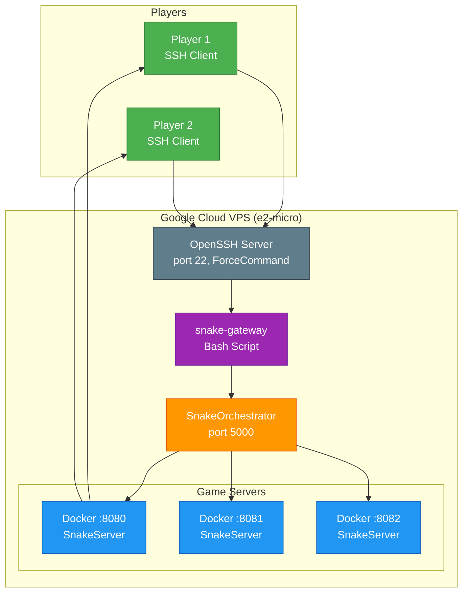

# Snake-CLI-Multiplayer

A real-time, networked game engine built with **C#** and **.NET 10**. This project focuses on high-precision terminal rendering, asynchronous engine architecture, and upcoming scalable multiplayer synchronization using **SignalR**.


## How to Play

Open your terminal and run:

```bash
ssh player@34.170.39.24
```
Press Enter, enter your name, and start playing with friends!


### Controls
* Arrow Keys or WASD - Move snake
* Ctrl + C - Exit Game

## System Architecture



### How It Works
#### 1. SSH Connection 

The player runs `ssh player@34.170.39.24`. The SSH server accepts the connection and immediately triggers the ForceCommand configured in `/etc/ssh/sshd_config`. Instead of giving the player a shell, it executes the gateway script.

#### 2. Gateway Script

 The `snake-gateway` script is a simple bash program that acts as a router. It has one job: figure out which game server has the fewest players, then launch the SnakeClient connected to that server. It does this by calling the Orchestrator's API.

#### 3. Orchestrator 

The Orchestrator is a web API running on port 5000. It maintains a list of all running game servers, tracks how many players are on each, and knows which ports are available. When the gateway asks for a server, it scans the list and returns the URL of the server with the lowest player count.

#### 4. Docker Container Management 

The Orchestrator uses the Docker API to manage game servers. When the first player connects and no servers are running, it spins up a new Docker container running SnakeServer. As more players join, it can start additional containers to distribute the load. When a server has no players for a while, it shuts down that container to save resources.

#### 5. SignalR Connection 

The SnakeClient receives the server URL from the gateway, appends `/gamehub`, and establishes a SignalR connection. SignalR uses WebSockets to maintain a persistent, bidirectional channel between client and server. Unlike HTTP where the client has to keep asking for updates, the server can push game state to the client instantly.

#### 6. Game Loop 

The SnakeServer runs a game loop using a `PeriodicTimer` that ticks every 100ms (10 FPS). On each tick, it updates all snake positions, checks for collisions between snakes and apples or each other, generates new apples if needed, and broadcasts the complete game state to all connected clients.

#### 7. Client Rendering 

The SnakeClient receives the game state and uses Spectre.Console to render it beautifully in the terminal. It doesn't redraw the entire screen each frame - instead, it uses cursor positioning to update only what changed, resulting in smooth animation without flicker.


## Concurrency Handling

### The Problem:

* Two players could submit moves simultaneously
* Game state updates could interleave unpredictably
* Snake positions could become corrupted or lost
### The Solution - ConcurrentDictionary:

We use `ConcurrentDictionary<string, Snake>` to store all active snakes in a thread-safe way. Unlike a regular dictionary that requires locks for safe concurrent access, this collection is designed specifically for multi-threaded environments.

When multiple players move at the same time, each operation completes safely without interfering with others. The collection handles the synchronization internally, so we don't need to manually lock and unlock.

This ensures that even when dozens of players submit moves simultaneously, the game state remains consistent and predictable.

## Project Structure
```bash
Multiplayer-CLI-Snake/
├── SnakeGame.sln                          # Solution file combining all projects
├── README.md                              # Project documentation
├── docker-compose.yml                     # Local Docker setup for testing
│
├── .github/
│   └── workflows/
│       └── build.yml                      # CI/CD - builds & releases Linux binaries
│
├── infrastructure/
│   ├── main.tf                            # GCP VM resource definition
│   ├── variables.tf                       # Terraform variables (region, zone)
│   ├── terraform.tfstate                  # Current infrastructure state
│   └── .terraform.lock.hcl                # Provider lock file
│
├── SnakeClient/                           # Terminal game client (players use this)
│   ├── SnakeClient.csproj                 # Client project config
│   └── Program.cs                         # Entry point, CLI args, SignalR connection
│
├── SnakeServer/                           # Game server (runs in Docker containers)
│   ├── SnakeServer.csproj                 # Server project config
│   ├── Program.cs                         # ASP.NET Core host, SignalR hub registration
│   ├── GameEngine.cs                      # Game loop, tick logic, state updates
│   ├── GameHub.cs                         # SignalR hub for client communication
│   ├── Snake.cs                           # Snake entity model
│   ├── Apple.cs                           # Apple entity model
│   └── CollisionManager.cs                # Collision detection logic
│
├── SnakeOrchestrator/                     # API service (manages game servers)
│   ├── SnakeOrchestrator.csproj           # Web project config
│   ├── Program.cs                         # ASP.NET Core API, endpoints
│   ├── OrchestratorService.cs             # Docker container lifecycle management
│   ├── PollingService.cs                  # Health checks, auto-scaling logic
│   └── ServerInstance.cs                  # Model for tracked server instances
│
└── SnakeShared/                           # Shared models across all projects
    ├── SnakeShared.csproj                 # Shared project config
    ├── GameState.cs                       # Shared game state model
    ├── SnakeState.cs                      # Snake state data
    ├── Position.cs                        # X,Y coordinate model
    └── Direction.cs                       # Direction enum (Up, Down, Left, Right)
```
## Tech Stack
* **Runtime:** .NET 10
* **Language:** C# 12
* **Networking:** ASP.NET Core SignalR (real-time)
* **Version Control:** Git
* **Containerisation:** Docker
* **Infrastructure:** Terraform (Google Cloud)
* **Cloud:** Google Cloud (e2-micro)
* **SSH Gateway:** OpenSSH + ForceCommand
* **CI/CD:** GitHub Actions
